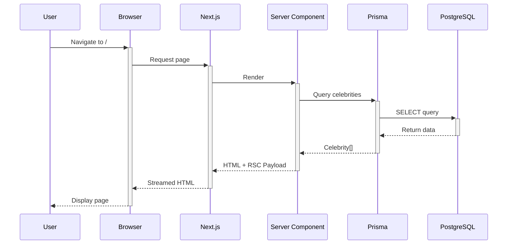
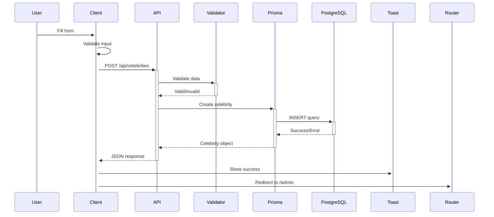

# 🏗️ Architecture Documentation

## System Overview

CelebHub is a production-ready celebrity biography platform built with modern web technologies, following best practices for scalability, security, and maintainability.

## Tech Stack

### Frontend
- **Framework:** Next.js 15.1.3 (App Router)
- **Language:** TypeScript 5.7.2
- **Styling:** Tailwind CSS 3.4.17
- **Components:** React 18.3.1 with Server Components

### Backend
- **Runtime:** Node.js 20 LTS
- **API:** Next.js API Routes (RESTful)
- **ORM:** Prisma 6.1.0
- **Database:** PostgreSQL 16

### Infrastructure
- **Containerization:** Docker & Docker Compose
- **Process Management:** PM2 (cluster mode)
- **Reverse Proxy:** Nginx (optional)
- **SSL:** Let's Encrypt (recommended)

## Architecture Patterns

### 1. Server-First Architecture

```
┌─────────────────┐
│  Next.js App    │
│  Router (RSC)   │
└────────┬────────┘
         │
    ┌────┴────┐
    │         │
┌───▼────┐ ┌─▼──────┐
│ Server │ │ Client │
│ Comps  │ │ Comps  │
└───┬────┘ └────────┘
    │
┌───▼─────────┐
│ API Routes  │
└──────┬──────┘
       │
┌──────▼──────┐
│   Prisma    │
│     ORM     │
└──────┬──────┘
       │
┌──────▼──────┐
│ PostgreSQL  │
└─────────────┘
```

### 2. Layered Architecture

**Presentation Layer:**
- React Server Components (RSC)
- Client Components ("use client")
- Streaming & Suspense
- Loading states
- Error boundaries

**Business Logic Layer:**
- API Routes (`/api/*`)
- Input validation
- Error handling
- Data transformation

**Data Access Layer:**
- Prisma ORM
- Database queries
- Transactions
- Connection pooling

**Database Layer:**
- PostgreSQL
- Indexes
- Constraints
- Migrations

### 3. Component Organization

```
src/
├── app/                      # Next.js App Router
│   ├── (routes)/            # Pages
│   ├── api/                 # API endpoints
│   ├── layout.tsx           # Root layout
│   └── globals.css          # Global styles
├── components/
│   ├── admin/               # Admin-specific
│   ├── celebrity/           # Celebrity-specific
│   ├── home/                # Homepage
│   ├── layout/              # Layout components
│   └── ui/                  # Shared UI
├── hooks/                   # Custom React hooks
└── lib/                     # Utilities & config
    ├── db.ts                # Prisma client
    ├── types.ts             # TypeScript types
    ├── utils.ts             # Helper functions
    ├── validations.ts       # Validation logic
    └── celebrity.ts         # Celebrity utilities
```

## Data Flow

### 1. Read Operation (Homepage)



### 2. Write Operation (Create Celebrity)



## Database Schema

### Entity Relationship

```
┌─────────────────────────┐
│      Celebrity          │
├─────────────────────────┤
│ id          (PK, cuid)  │
│ name        VARCHAR(255)│ ← Indexed
│ profession  VARCHAR(255)│ ← Indexed
│ birthDate   TIMESTAMP   │
│ birthPlace  VARCHAR(255)│
│ bio         TEXT        │
│ image       VARCHAR(1000)
│ slug        VARCHAR(300)│ ← Unique, Indexed
│ createdAt   TIMESTAMPTZ │ ← Indexed
│ updatedAt   TIMESTAMPTZ │
└─────────────────────────┘
```

### Indexes Strategy

```sql
-- Primary Key Index (automatic)
CREATE INDEX ON celebrities(id);

-- Search optimization
CREATE INDEX ON celebrities(name);
CREATE INDEX ON celebrities(profession);

-- Sorting optimization
CREATE INDEX ON celebrities(createdAt DESC);

-- Unique slug lookup
CREATE UNIQUE INDEX ON celebrities(slug);
```

## API Design

### RESTful Endpoints

**Base URL:** `/api/celebrities`

| Method | Endpoint         | Description          | Auth |
|--------|------------------|----------------------|------|
| GET    | /                | List celebrities     | No   |
| GET    | /:id             | Get single celebrity | No   |
| POST   | /                | Create celebrity     | No*  |
| PUT    | /:id             | Update celebrity     | No*  |
| DELETE | /:id             | Delete celebrity     | No*  |

*Future: Will require authentication

### Request/Response Format

**GET /api/celebrities**
```typescript
// Query Parameters
{
  search?: string   // Max 100 chars
  page?: number     // Default: 1
  limit?: number    // Default: 12, Max: 100
}

// Response
{
  celebrities: Celebrity[]
  pagination: {
    total: number
    page: number
    limit: number
    totalPages: number
  }
}
```

**POST /api/celebrities**
```typescript
// Request Body
{
  name: string          // Required, 2-255 chars
  profession?: string   // Max 255 chars
  birthDate?: string    // ISO date
  birthPlace?: string   // Max 255 chars
  bio?: string          // Max 50,000 chars
  image?: string        // URL, max 1000 chars
}

// Response
Celebrity | { error: string }
```

### Error Handling

```typescript
// Standard error response
{
  error: string         // User-friendly message
  details?: string      // Development only
}

// HTTP Status Codes
200 - OK
201 - Created
400 - Bad Request (validation error)
404 - Not Found
409 - Conflict (duplicate)
500 - Internal Server Error
```

## Performance Optimizations

### 1. Database Level

**Indexing:**
- B-tree indexes on frequently queried fields
- Covering indexes for common queries
- Partial indexes for filtered queries

**Query Optimization:**
```typescript
// Parallel queries
const [celebrities, total] = await Promise.all([
  prisma.celebrity.findMany({ ... }),
  prisma.celebrity.count({ ... })
])

// Select only needed fields
prisma.celebrity.findUnique({
  where: { slug },
  select: { id: true }
})
```

**Connection Pooling:**
```javascript
// Prisma handles automatically
pool_size: 10
pool_timeout: 20s
```

### 2. Application Level

**Server Components:**
- Zero JavaScript bundle for static content
- Streaming responses
- Parallel data fetching

**Caching:**
```typescript
// API caching
headers: {
  'Cache-Control': 'public, s-maxage=60, stale-while-revalidate=120'
}

// Static generation
export const revalidate = 60
```

**Code Splitting:**
```typescript
// Automatic with Next.js App Router
// Dynamic imports where needed
const Component = dynamic(() => import('./Component'))
```

### 3. Build Optimizations

**Next.js Config:**
```javascript
{
  compress: true,              // Gzip compression
  output: 'standalone',        // Minimal production bundle
  images: {
    formats: ['image/avif', 'image/webp']
  }
}
```

**Docker Multi-stage:**
```dockerfile
# Separate build stages
FROM node:20-alpine AS deps
FROM node:20-alpine AS builder
FROM node:20-alpine AS runner
```

## Security Architecture

### 1. Defense in Depth

```
┌─────────────────────────────┐
│   Nginx (SSL/TLS)           │ ← Layer 1: Transport
├─────────────────────────────┤
│   Security Headers          │ ← Layer 2: HTTP
├─────────────────────────────┤
│   Input Validation          │ ← Layer 3: Application
├─────────────────────────────┤
│   Prisma ORM (SQL Safe)     │ ← Layer 4: Data Access
├─────────────────────────────┤
│   PostgreSQL (Permissions)  │ ← Layer 5: Database
└─────────────────────────────┘
```

### 2. Input Validation Flow

```typescript
Request
  → Type Check (TypeScript)
  → Length Validation (Constants)
  → Format Validation (Regex/Date)
  → Business Logic Validation
  → Sanitization (Trim/Escape)
  → Database Operation
```

### 3. Error Isolation

```typescript
try {
  // Operation
} catch (error) {
  console.error('Internal:', error) // Server logs
  return {
    error: 'User-friendly message'  // Client response
    // NO stack traces in production
  }
}
```

## Scalability

### Horizontal Scaling

**PM2 Cluster Mode:**
```javascript
{
  instances: 'max',      // Use all CPU cores
  exec_mode: 'cluster',  // Cluster mode
  max_memory_restart: '1G'
}
```

**Load Balancing:**
```nginx
upstream celebhub {
    least_conn;
    server app1:3000;
    server app2:3000;
    server app3:3000;
}
```

### Vertical Scaling

**Database:**
- Increase connection pool
- Add read replicas
- Optimize queries
- Add caching layer (Redis)

**Application:**
- Increase container resources
- Optimize bundle size
- Implement CDN
- Add edge caching

### Caching Strategy

```
┌─────────┐
│ Browser │ ← Cache-Control headers
└────┬────┘
     │
┌────▼────┐
│   CDN   │ ← Static assets
└────┬────┘
     │
┌────▼────┐
│  Edge   │ ← Next.js middleware
└────┬────┘
     │
┌────▼────┐
│  Redis  │ ← API responses (future)
└────┬────┘
     │
┌────▼────┐
│Database │ ← Source of truth
└─────────┘
```

## Deployment Architecture

### Docker Compose (Simple)

```yaml
services:
  postgres:  # Database
    - Port: 5433 (external)
    - Network: celebhub_network
    - Volume: postgres_data

  app:       # Application
    - Port: 3000
    - Network: celebhub_network
    - Depends: postgres
```

### Production (Recommended)

```
Internet
    │
    ├─→ Cloudflare (CDN + DDoS)
    │
    ├─→ Nginx (SSL + Load Balancer)
    │   ├─→ App Instance 1 (PM2)
    │   ├─→ App Instance 2 (PM2)
    │   └─→ App Instance 3 (PM2)
    │
    └─→ PostgreSQL (Primary + Read Replicas)
```

## Monitoring & Observability

### Metrics

**Application:**
- Request rate
- Response time
- Error rate
- Memory usage
- CPU usage

**Database:**
- Query performance
- Connection pool
- Slow queries
- Index usage
- Table size

**Infrastructure:**
- Container health
- Disk usage
- Network I/O
- Uptime

### Logging Strategy

```typescript
// Structured logging
{
  level: 'info|warn|error',
  timestamp: ISO8601,
  message: string,
  context: {
    userId?: string,
    action: string,
    resource: string
  }
}
```

### Health Checks

**Application:**
```
GET /api/health
→ {
  status: 'ok',
  database: 'connected',
  uptime: seconds
}
```

**Docker:**
```dockerfile
HEALTHCHECK --interval=30s \
  CMD wget --spider http://localhost:3000/api/health
```

## Future Enhancements

### Short-term (1-3 months)

- [ ] Authentication (NextAuth.js)
- [ ] Image upload (local + S3)
- [ ] Full-text search (PostgreSQL)
- [ ] Rate limiting (Upstash)
- [ ] Analytics (Google Analytics)

### Medium-term (3-6 months)

- [ ] Caching layer (Redis)
- [ ] Background jobs (Bull Queue)
- [ ] Email notifications (SendGrid)
- [ ] Multi-language (i18n)
- [ ] Comments system

### Long-term (6-12 months)

- [ ] Mobile app (React Native)
- [ ] GraphQL API (optional)
- [ ] Microservices (if needed)
- [ ] ML recommendations
- [ ] Real-time features (WebSocket)

## Development Workflow

```bash
# Local Development
npm run dev
  → Next.js dev server
  → Hot Module Replacement
  → TypeScript checking
  → Prisma Studio

# Build
npm run build
  → Prisma generate
  → Next.js build
  → Type checking
  → Bundle optimization

# Production
docker-compose up -d
  → Build images
  → Start services
  → Run migrations
  → Health checks
```

## Testing Strategy (Future)

### Unit Tests
- Utility functions
- Validation logic
- Business logic

### Integration Tests
- API endpoints
- Database operations
- Component rendering

### E2E Tests
- User flows
- Critical paths
- Cross-browser

```bash
# Testing stack (planned)
- Jest (unit)
- Testing Library (React)
- Playwright (E2E)
- Supertest (API)
```

---

**Version:** 1.0.0
**Last Updated:** 2025-01-28
**Maintained by:** CelebHub Team
